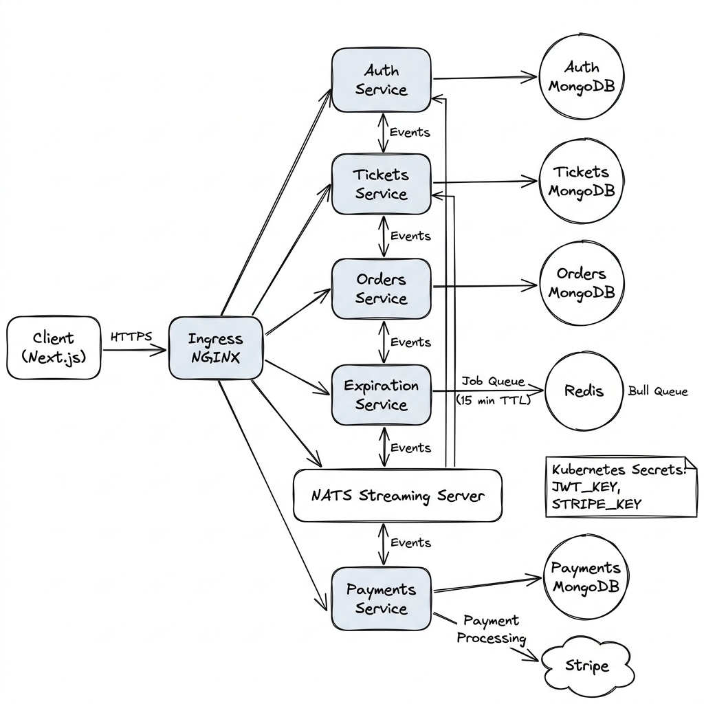

# Ticketing System

## Architecture



### Overview

- Users can list a ticket for an event (concert, sports) for sale
-  Other users can purchase these tickets
- Any user can list tickets for sale and purchase tickets
- When a user attempts to purchase a ticket, the ticket is locked for 15 minutes. The user has 15 minutes to enter their payment info.
- While locked, no other user can purchase the ticket. After 15 minutes, the ticket should unlock
- Ticket prices can be edited if they are not locked

### Services

- Auth - Everything related to user signup/signin/signout
- Tickets - Ticket creation/editing. Knows whether a ticket can be updated
- Orders - Order creating/editing
- Expiration - Watches for orders to be created, cancels them after 15 min
- Payments - Handles credit card payments. Cancels orders if payment fails, completes if payment succeeds

# What's this project cover

- Microservices with Event Bus Architecture
- NATS Messaging
- Load Balancing with Ingress NGINX
- Common module between services with npm
- Decentralized Authentication with JWT
- Resource Versioning for concurrency issues
- Redis Job queue with Bull
- Stripe, 3rd party payment service
- Server Side Rendering with Next.js
- Test Driven Development
- CI/CD with Github Actions
- Deploy to Digital Ocean

# Want to know more

### The business process

The website being developed here is a ticketing website where you can: signin/signup, list tickets, buy a ticket, checkout with stripe & see the list of orders. When you click purchase on a ticket page, the system will lock the ticket for 15 minutes and no one can buy it. You'll then be redirected to the order page with checkout powered by stripe payment. There you'll enter your card number and pay the ticket. A text will appear, showing the status of the order. On the other hand, if you fail to purchase the ticket within 15 minutes, then the system will unlock the ticket and your order will be cancelled. You can also see the order history on the My Orders page

### How to Run

#### Prerequisites

- [Docker Desktop](https://www.docker.com/products/docker-desktop/) installed and running
- [Skaffold](https://skaffold.dev/docs/install/) installed (`brew install skaffold` on macOS)
- A [Stripe](https://stripe.com/) account (for the publishable & secret API keys)

#### Steps

1. **Enable Kubernetes** in Docker Desktop  
   Open Docker Desktop → Settings → Kubernetes → Check _"Enable Kubernetes"_ → Click _Apply & Restart_. Wait until the Kubernetes status indicator turns green.

2. **Install ingress-nginx controller**
   ```bash
   kubectl apply -f https://raw.githubusercontent.com/kubernetes/ingress-nginx/controller-v1.12.2/deploy/static/provider/cloud/deploy.yaml
   ```
   Verify it's running:
   ```bash
   kubectl get pods -n ingress-nginx
   ```

3. **Create Kubernetes secrets**  
   The cluster needs two secrets before the pods can start:
   ```bash
   kubectl create secret generic jwt-secret --from-literal JWT_KEY=INSERT_RANDOM_STRING
   kubectl create secret generic stripe-secret \
     --from-literal STRIPE_KEY=sk_test_INSERT_STRIPE_SECRET_KEY \
     --from-literal STRIPE_PUB_KEY=pk_test_INSERT_STRIPE_PUBLISHABLE_KEY
   ```

4. **Start the project**
   ```bash
   skaffold dev
   ```
   Run this from the project's root directory. Skaffold will build all service images and deploy them to your local Kubernetes cluster.
